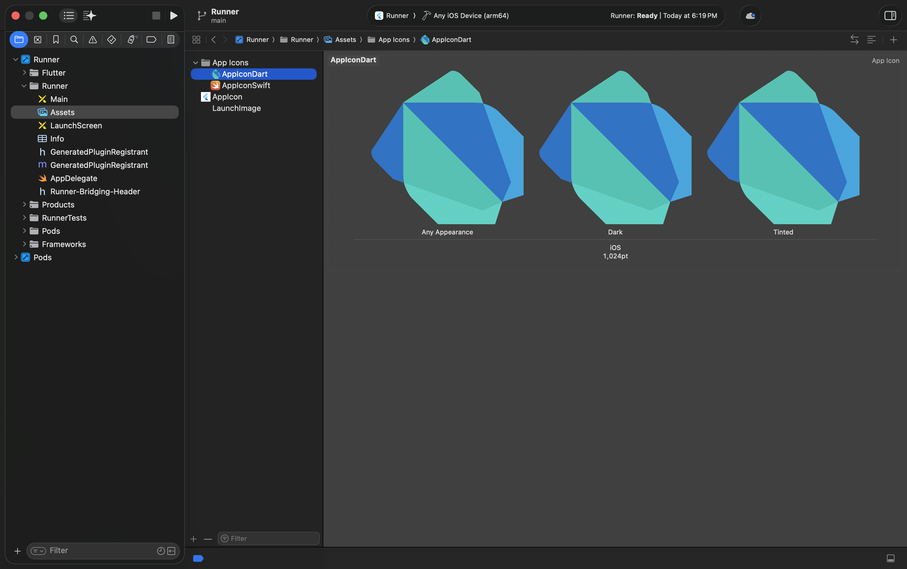
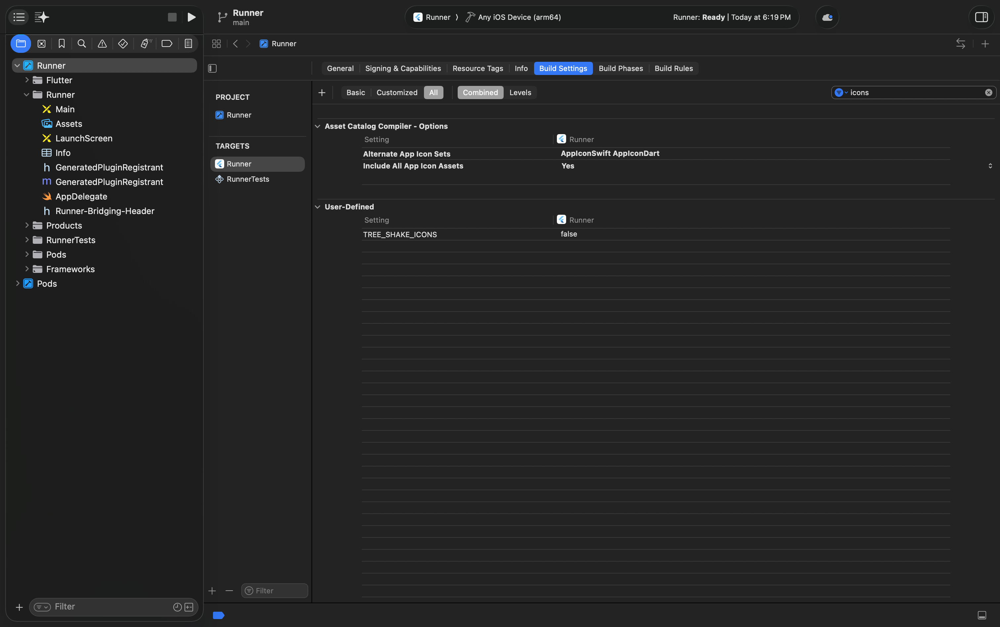

# flutter_dynamic_launcher_icon

[](https://pub.dev/packages/flutter_dynamic_launcher_icon) [](LICENSE)

## A Lightweight Flutter Plugin for Dynamic Launcher Icons

A lightweight Flutter plugin that lets you dynamically change your app's launcher icon at runtime — with full Android and iOS support.

---

## 🎬 Demo


### 📱 Platform Behavior

#### Android Icon Change Behavior

On Android, icon changes work differently than iOS to ensure a smooth user experience:

- **Deferred Icon Application**:
        - When you call `changeIcon()`, the request is saved but not immediately applied.
        - The icon change is deferred until the app goes to the background (e.g., when the user presses home or switches apps).
        - This prevents the app from being killed while the user is actively using it.

- **Why This Approach?**:
        - Android requires disabling/enabling components to change icons, which can cause app restarts.
        - Immediate changes would interrupt the user's current session.
        - By waiting for the background state, the change happens at a natural transition point.

---

#### iOS Icon Change Behavior

iOS provides native support for alternate icons with a smooth, immediate experience:

- **Instant Application**:
        - Icon changes apply immediately when `changeIcon()` is called.
        - Uses iOS's native `UIApplication.shared.setAlternateIconName()` API.
        - Available on iOS 10.3+.

---

## Table of Contents

- [Android Setup](#android-setup)
- [iOS Setup](#ios-setup)
- [Usage](#usage)
- [API Reference](#api-reference)
- [Contributing](#contributing)
- [License](#license)

---

## 🧩 Android Setup

### 🔧 Installation

Add the dependency to your `pubspec.yaml`:

```yaml
dependencies:
  flutter_dynamic_launcher_icon: ^<latest_version>
```

Fetch the packages:

```bash
flutter pub get
```

### 🧹 Clean & Full Restart

Since this plugin includes native Android code, perform a clean build and fully restart the app:

```bash
flutter clean
flutter pub get
flutter run
```


### 🖼️ Add Launcher Icons

Place your launcher icon image files inside the `res/mipmap` folders:

```plaintext
android/app/src/main/res/
  ├─ mipmap-mdpi/
  ├─ mipmap-hdpi/
  ├─ mipmap-xhdpi/
  ├─ mipmap-xxhdpi/
  └─ mipmap-xxxhdpi/
```

Example filenames:

```plaintext
mipmap-mdpi/ic_launcher_dart.png
mipmap-hdpi/ic_launcher_dart.png
mipmap-xhdpi/ic_launcher_dart.png
mipmap-xxhdpi/ic_launcher_dart.png
mipmap-xxxhdpi/ic_launcher_dart.png
```

Repeat this for all alternate icons you want to use.

### 🧾 AndroidManifest.xml Setup

Update your `AndroidManifest.xml` to define activity aliases for alternate icons:

```xml
<manifest xmlns:android="http://schemas.android.com/apk/res/android"
  package="com.example.app">

  <application
    android:icon="@mipmap/ic_launcher"
    android:label="My App">

    <activity
      android:name=".MainActivity"
      android:exported="true"
      android:launchMode="singleTop"
      android:theme="@style/LaunchTheme">
      <intent-filter>
        <action android:name="android.intent.action.MAIN" />
        <category android:name="android.intent.category.LAUNCHER" />
      </intent-filter>
    </activity>

    <!-- Alternate Icon 1 -->
    <activity-alias
      android:name=".AppIconDart"
      android:enabled="false"
      android:icon="@mipmap/ic_launcher_dart"
      android:targetActivity=".MainActivity">
      <intent-filter>
        <action android:name="android.intent.action.MAIN" />
        <category android:name="android.intent.category.LAUNCHER" />
      </intent-filter>
    </activity-alias>

    <!-- Alternate Icon 2 -->
    <activity-alias
      android:name=".AppIconSwift"
      android:enabled="false"
      android:icon="@mipmap/ic_launcher_swift"
      android:targetActivity=".MainActivity">
      <intent-filter>
        <action android:name="android.intent.action.MAIN" />
        <category android:name="android.intent.category.LAUNCHER" />
      </intent-filter>
    </activity-alias>
  </application>
</manifest>
```

> **Notes:**
> - `android:enabled="false"` keeps alternate icons disabled until activated.
> - `android:targetActivity` must always point to `.MainActivity`.
> - If your project uses an applicationIdSuffix or a custom setup, you may need to specify the fully qualified class name in android:name.

```xml
<activity-alias
        android:name="${applicationId}.AppIconDart"
        android:enabled="false"
        android:icon="@mipmap/ic_launcher_dart"
        android:targetActivity=".MainActivity">
        <intent-filter>
                <action android:name="android.intent.action.MAIN" />
                <category android:name="android.intent.category.LAUNCHER" />
        </intent-filter>
</activity-alias>
```

---

## 🍎 iOS Setup

### 🧭 Steps in Xcode

1. Open the `ios/Runner` project in Xcode.
2. Navigate to **Assets.xcassets** and create a new folder: **App Icons → New iOS App Icon**.
3. Add your alternate icons (e.g., `AppIconDart`, `AppIconSwift`) in the asset catalog.




4. Go to **Runner → Build Settings** and search for "Alternate App Icon Sets."
5. Add the names of your alternate icons.





> **Notes:**
> - Ensure the names in "Alternate App Icon Sets" match the icon set folder names.

---

## 🚀 Usage

### 📦 Import

```dart
import 'package:flutter_dynamic_launcher_icon/flutter_dynamic_launcher_icon.dart';
```

### 🎯 Change App Icon

To switch icons:

```dart
await FlutterDynamicLauncherIcon.changeIcon('AppIconDart');
```

To reset to the default icon:

```dart
await FlutterDynamicLauncherIcon.changeIcon(null);
```

### ⚙️ Example

```dart
import 'package:flutter/material.dart';
import 'package:flutter_dynamic_launcher_icon/flutter_dynamic_launcher_icon.dart';

class IconSwitcherExample extends StatefulWidget {
  @override
  _IconSwitcherExampleState createState() => _IconSwitcherExampleState();
}

class _IconSwitcherExampleState extends State<IconSwitcherExample> {
  String? _currentIcon;

  @override
  void initState() {
    super.initState();
    _loadCurrentIcon();
  }

  Future<void> _loadCurrentIcon() async {
    final icon = await FlutterDynamicLauncherIcon.alternateIconName;
    setState(() => _currentIcon = icon);
  }

  Future<void> _changeIcon(String? iconName) async {
    await FlutterDynamicLauncherIcon.changeIcon(iconName);
    await _loadCurrentIcon();
  }

  @override
  Widget build(BuildContext context) {
    return Scaffold(
      appBar: AppBar(title: Text('Dynamic Icon Example')),
      body: Center(
        child: Column(
          mainAxisAlignment: MainAxisAlignment.center,
          children: [
            Text('Current Icon: ${_currentIcon ?? "Default"}'),
            ElevatedButton(
              onPressed: () => _changeIcon('AppIconDart'),
              child: Text('Switch to Dart Icon'),
            ),
            ElevatedButton(
              onPressed: () => _changeIcon('AppIconSwift'),
              child: Text('Switch to Swift Icon'),
            ),
            ElevatedButton(
              onPressed: () => _changeIcon(null),
              child: Text('Reset to Default'),
            ),
          ],
        ),
      ),
    );
  }
}
```

---

## 🧩 API Reference

| Method | Description |
|--------|-------------|
| `changeIcon(String? iconName, {bool silent})` | Changes the launcher icon dynamically. Pass `null` to reset. |
| `alternateIconName` | Returns the currently active icon name, or `null` if using the default icon. |
| `isSupported` | Returns `true` if the platform supports dynamic icons. |

---

## 🤝 Contributing

Contributions are welcome! Please feel free to submit a Pull Request.

---

## 📜 License

This project is licensed under the [MIT License](LICENSE).